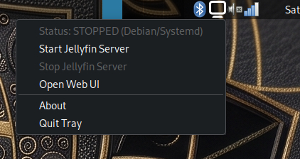
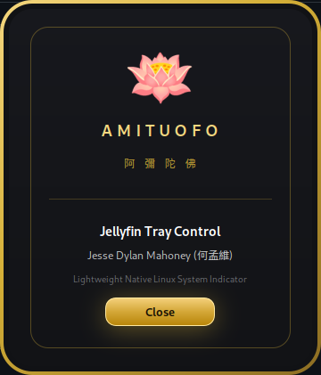

# Jellyfin Tray Control

## Visual Preview

| Tray Menu Interface | Luxury About Dialog |
| :---: | :---: |
|  |  |

---


## Features

- **Auto-Detection:** Automatically detects native systemd service (`jellyfin.service) or Flatpak container (`org.jellyfin.JellyfinServer`).
-​ **Event-Driven:** Uses GIO D-Bus signal subscriptions instead of active polling (0.0% idle CPU).
- **Zero-Password Control:** Direct integration with systemd via PolicyKit rules without requiring passwords.
- **Lightweight:** Minimal memory footprint (<15 MB RSS).
- **Non-Blocking:** Responsive GTK3 / AyatanaAppIndicator interface.

## Security & Privileges

- **Polkit Integration:** Uses a scoped JavaScript PolicyKit rule (`10-jellyfin.rules`) restricted exclusively to `jellyfin.service`.
- **No Sudoers Modification:** Zero `/etc/sudoers.d/` overrides, preserving standard Linux privilege boundaries and user-space security.

## Installation & Dependencies (Debian/Ubuntu)

Install dependencies:
```bash
sudo apt install python3-gi python3-gi-cairo gir1.2-gtk-3.0 gir1.2-ayatanaappindicator3-0.1
```

Install binary, Polkit rule, and desktop launcher:
```bash
sudo install -m 0644 10-jellyfin.rules /etc/polkit-1/rules.d/
sudo install -m 755 jellyfin-tray /usr/local/bin/jellyfin-tray
sudo install -m 644 jellyfin-tray.desktop /usr/share/applications/
```

...( Optional ) ... Enable automatic startup on desktop login:
```bash
mkdir -p ~/.config/autostart
cp jellyfin-tray.desktop ~/.config/autostart/
```

## Uninstallation

```bash
sudo rm -f /usr/local/bin/jellyfin-tray \
           /etc/polkit-1/rules.d/10-jellyfin.rules \
           /usr/share/applications/jellyfin-tray.desktop
rm -f ~/.config/autostart/jellyfin-tray.desktop
```

## License

Copyright (C) 2026 Jesse Dylan Mahoney (何孟維)

This program is free software: you can redistribute it and/or modify it under the terms of the GNU General Public License as published by the Free Software Foundation, either version 3 of the License, or (at your option) any later version.

This program is distributed in the hope that it will be useful, but WITHOUT ANY WARRANTY; without even the implied warranty of MERCHANTABILITY or FITNESS FOR A PARTICULAR PURPOSE. See the GNU General Public License for more details.

## Disclaimer

This project is an independent open-source utility and is not affiliated, associated, authorized, endorsed by, or in any way officially connected with the Jellyfin project, Jellyfin team, or any of its subsidiaries or affiliates.
